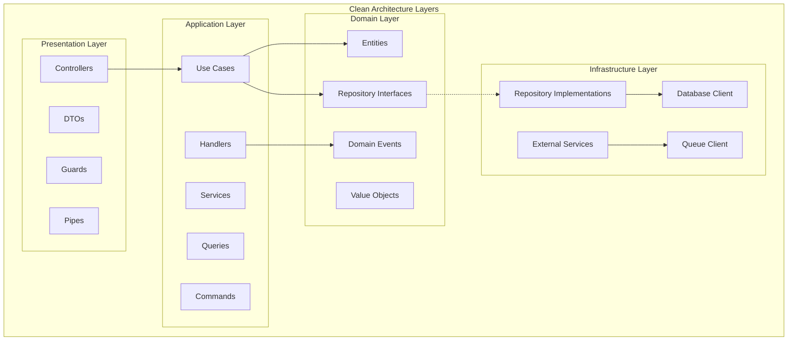

# Video Streaming Backend - System Design

This document outlines the system architecture, design decisions, and technical justifications for the video streaming platform backend.

## Table of Contents

- [Clean Architecture Layers](#clean-architecture-layers)
- [Data Flow Diagrams](#data-flow-diagrams)
- [Design Decisions](#design-decisions)
- [Third-Party Tools Justification](#third-party-tools-justification)

## Clean Architecture Layers

## Design Decisions

### 1. Modular Monolithic Architecture

**Decision**: Use modular monolith instead of microservices initially.

**Rationale**:

- **Simplified Development**: Single deployment unit, easier debugging
- **Data Consistency**: ACID transactions across modules
- **Performance**: No network latency between modules
- **Cost Effective**: Single infrastructure setup
- **Evolution Path**: Easy to extract microservices later

**Trade-offs**:

- ✅ Faster development and deployment
- ✅ Simpler data consistency
- ❌ Potential scalability bottlenecks
- ❌ Technology coupling

### 2. Clean Architecture + DDD

**Decision**: Implement Clean Architecture with Domain-Driven Design principles.

- **Separation of Concerns**: Clear layer boundaries
- **Testability**: Easy to mock dependencies
- **Business Logic Protection**: Domain layer isolated from external concerns
- **Maintainability**: Changes in one layer don't affect others

### 3. CQRS Pattern

**Decision**: Separate command and query operations.

- **Scalability**: Different optimization strategies for reads/writes
- **Complexity Management**: Clear separation of concerns
- **Performance**: Optimized query models

### 4. Strategy Pattern for Search

**Decision**: Use Strategy pattern for multiple search implementations.

- **Flexibility**: Switch between search engines
- **Fallback**: Graceful degradation when Elasticsearch is down
- **Testing**: Easy to mock search implementations

## Third-Party Tools Justification

### 1. NestJS Framework

- **TypeScript First**: Strong typing and better developer experience
- **Decorator-based**: Clean, readable code structure
- **Dependency Injection**: Built-in IoC container
- **Enterprise Ready**: Guards, interceptors, pipes, filters
- **Testing Support**: Built-in testing utilities

### 2. PostgreSQL Database

- **ACID Compliance**: Strong consistency guarantees
- **JSON Support**: Flexible schema for metadata
- **Full-text Search**: Built-in search capabilities
- **Mature Ecosystem**: Extensive tooling and community
- **Scalability**: Proven at enterprise scale
